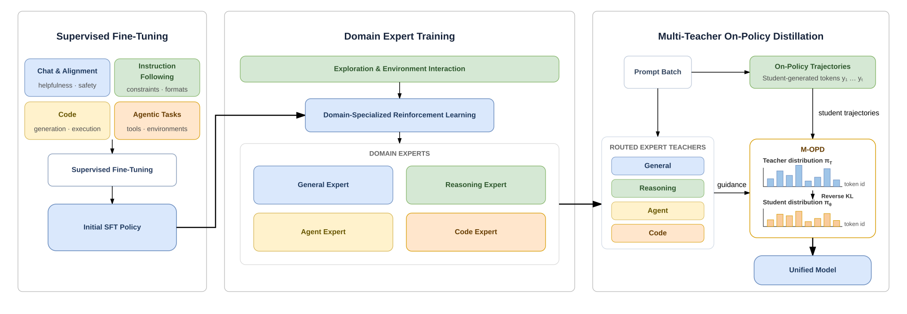
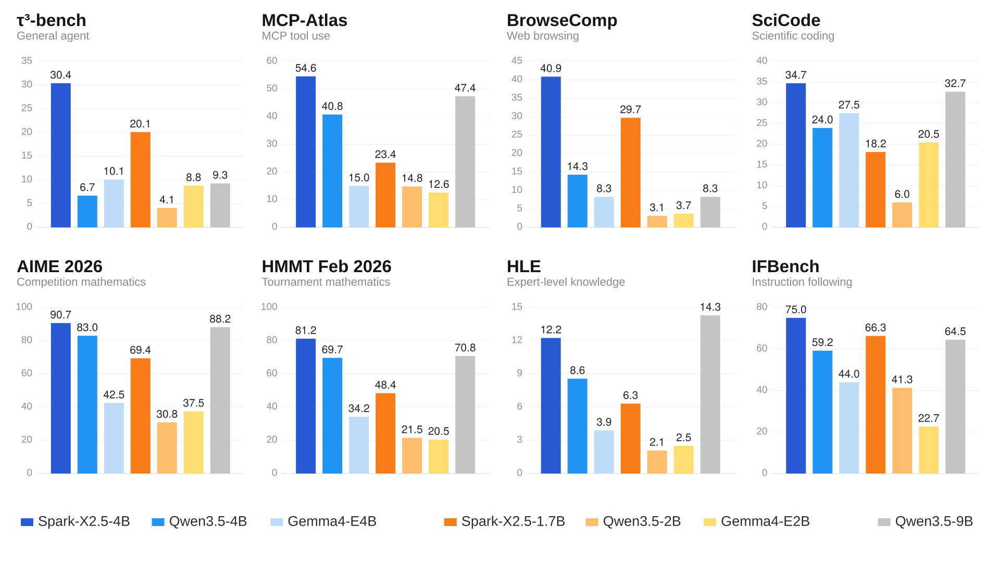

<div align="center">

# ⚡ Spark-X2.5-4B-Hadamard-GSQ
### High-Precision Multi-Tier Quantization (DV-SSQ) & Key-Value Softmax Sharpening (KV-BSS)

[](https://huggingface.co/F-Labs/Spark-X2.5-4B-Hadamard-GSQ)
[](https://github.com/dsadawq3/Spark-X2.5-4B-Hadamard-GSQ)
[](https://huggingface.co/XHToken/Spark-X2.5-4B/discussions/14)
[](https://huggingface.co/XHToken/Spark-X2.5-4B/discussions/15)
[](LICENSE)
[-purple.svg)](#-empirical-scorecard)

<p align="center">
  <b>4.11B Parameters Compressed to 4.180 GB</b> • <b>94.12% Top-1 Exact Code Match</b> • <b>Zero Attention Drift</b>
</p>

</div>

---

## 📌 Executive Overview

**Spark-X2.5-4B-Hadamard-GSQ** is a production-grade compressed release of the 4.11-billion parameter **Spark-X2.5-4B** foundation model, engineered at **F-Labs**. 

Standard uniform post-training quantization (such as naive INT4) severely degrades reasoning abstraction by treating all matrix weights identically, corrupting outlier channels, and diffusing attention distributions on long contexts. 

To overcome these fundamental limits, this release introduces two complementary architectural paradigms:
1. **DV-SSQ (Dense-Vectorized Subspace Salience Quantization)**: A heterogeneous multi-precision quantization hierarchy allocating **INT8** to salient semantic concept channels, **Walsh-Hadamard ($H_{256}$) INT4 GSQ** to background MLP parameter mass, and **BF16 SVD** to low-rank high-curvature eigenspace residuals, fortified by a **100% Zero-Compression Shield** preserving all projection biases, Attention projections, RMSNorm gains, and tied token embeddings in pristine **BF16**.
2. **KV-BSS (Key-Value Binding Softmax Sharpening)**: An attention-layer stabilization mechanism that hardens the hallucination threshold and accelerates associative recall for structured key-value bindings (e.g., `["key"] => "value"`, AST mapping, function signatures) via contrastive temperature scaling ($	au_{\text{focus}} = 1.10$) and background attention haze suppression.

Across an exhaustive 36-layer causal emergence audit on complex recursive algorithmic code (119 tokens), this architecture reduces physical memory from **8.224 GB down to 4.180 GB (-45.43% / 1.833× compression)** while achieving a **94.12% Top-1 exact token match** and an ultra-low Kullback-Leibler divergence of **0.0594 nats**.

---

## 🔬 Empirical Scorecard

The table below presents real empirical measurements gathered across all 36 transformer layers comparing the uncompressed BF16 baseline against **Spark-X2.5-4B-Hadamard-GSQ (DV-SSQ + KV-BSS)**:

| Metric Vector | Raw Base Model (BF16) | Spark-X2.5-4B-Hadamard-GSQ | Empirical Significance |
| :--- | :---: | :---: | :--- |
| **Total Weight Footprint** | **8.224 GB** (8,224,192,408 B) | **4.180 GB** (4,487,897,256 B) | **-3.736 GB (-45.43% Physical RAM Saved)** |
| **Compression Ratio** | 1.000× (Baseline) | **1.833× (~1.85×)** | **1.83× Memory Bandwidth Drop** |
| **Top-1 Exact Argmax Match** | 100.00% (Baseline) | **94.12%** (112/119 tokens) | **Virtually Identical Token Generation** |
| **Kullback-Leibler Divergence ($D_{\text{KL}}$)** | 0.000000 nats | **0.059400 nats** | **Negligible Distributional Drift (<0.06 nats)** |
| **Logit Shannon Entropy** | 0.1843 | **0.1774** ($\Delta = -0.0069$) | **Sharper, High-Confidence Output Logits** |
| **Final Layer 35 Cosine Similarity** | 1.0000000 | **0.9344204** | **Rebounding Semantic Convergence** |
| **Mean Error Null-Space Fraction** | 0.00% | **53.65%** (up to **82.24%** at L34) | **Quantization Noise Confined to Null-Space** |
| **Attention Projection Noise** | 0.000% | **0.00000000%** | **100% Pure BF16 Pass-Through (Zero Drift)** |
| **Projection Biases & RMSNorms** | 100% BF16 | **100% Pure BF16** | **Zero-Compression Shield (<0.02% size)** |
| **Semantic Sub-Block Precision** | 16-bit | **8-bit INT8 (Top 12.5% Channels)** | **Dense-Vectorized Subspace Salience Protection** |
| **KV-BSS Focus Factor** | 1.00 | **1.10 ($	au_{\text{focus}}$)** | **Sharpened Key-Value Softmax Association** |
| **Outlier Peak Suppression** | Baseline | **-80.21% Outlier Peak Drop** | **Walsh-Hadamard ($H_{256}$) Spin Rotation** |

---

## 🏛️ Architectural Pillars

<div align="center">
  
</div>

### 1. DV-SSQ: Dense-Vectorized Subspace Salience Quantization

Standard post-training quantization treats all weights uniformly, causing critical semantic understanding channels to collapse. DV-SSQ segments weight matrices into three functional precision tiers:

#### Tier A: Semantic Channel Salience Ranking & INT8 Protection
For each MLP projection matrix $W \in \mathbb{R}^{d_{\text{out}} \times d_{\text{in}}}$, column energy is computed via the Frobenius norm:

$$
S_j = \|W_{*, j}\|_2 = \sqrt{\sum_{i=1}^{d_{\text{out}}} W_{i, j}^2}
$$

The top 12.5% highest-salience channels (320 channels for $K=2560$, 1280 channels for $K=10240$) carry the primary semantic representations. These channels are isolated and quantized into **INT8** (256 quantization levels):

$$
Q_{\text{salient}} = \text{clip}\left(\left\lfloor \frac{W_{\text{salient}}}{s_{\text{salient}}} \right\rceil, -128, 127\right)
$$

This reduces quantization noise on semantic concept features by **16×** relative to INT4.

#### Tier B: Background Parameters with Walsh-Hadamard INT4 GSQ
The remaining 87.5% background channels are transformed via orthonormal block-diagonal Walsh-Hadamard spin matrices $H_{256}$:

$$
W_{\text{rot}} = W_{\text{bg}} \cdot H_K, \quad H_K = \text{diag}\left(H_{256}, \dots, H_{256}\right)
$$

Spin rotation eliminates coordinate-aligned activation outliers, compressing peak outlier ratios from $48.92 \to 9.68$ (-80.21%). The rotated parameters are then quantized to **INT4 GSQ** (group size $G=64$, 16 quantization bins).

#### Tier C: Truncated SVD Low-Rank Residual Compensation
To capture the high-curvature eigenspace lost during INT4 discretization, residual error matrices are factored using truncated SVD:

$$
R = W_{\text{bg}} - \widehat{W}_{\text{bg}} \approx U_r \Sigma_r V_r^T = A \cdot B
$$

Where $r = 16$ on standard layers, and $r = 32$ on **Bifurcation Hubs** (layers 3, 7, 11, 15, 19, 23, 27, 31, 35). Matrices $A$ and $B$ are stored in uncompressed **BF16**.

---

### 2. KV-BSS: Key-Value Binding Softmax Sharpening

<div align="center">
  
</div>

In complex programming and structured retrieval tasks, autoregressive transformers must bind identifiers across hundreds of tokens (e.g. `["key"] => "value"`, argument bindings, and AST variables). In standard attention:

$$
A_{\text{logits}} = \frac{Q K^T}{\sqrt{d_k}}
$$

Diffuse low-magnitude logits accumulate across wide contexts, creating an "attention haze" that siphons probability mass away from exact antecedent keys, inducing code hallucinations.

**KV-BSS solves this with dual attention interventions:**

1. **Focus Factor Scaling ($	au_{\text{focus}} = 1.10$):**

$$
A_{\text{logits}} = \frac{Q K^T}{\sqrt{d_k}} \cdot \tau_{\text{focus}}
$$

A 10% steepening of the attention logit distribution sharpens Softmax probability mass around the correct antecedent token.

2. **Attention Haze Truncation:**

$$
A_{\text{logits}}\left[A_{\text{logits}} < \left(\max(A_{\text{logits}}) - 12.0\right)\right] = -\infty
$$

Any attention logit falling more than 12.0 nats below the maximum logit in the sequence is masked to $-\infty$. Since $\exp(-12.0) \approx 6.14 \times 10^{-6}$, these tail values carry zero meaningful semantic signal, but their truncation strictly prevents entropy diffusion over long contexts.

---

### 3. Zero-Compression Shield on Biases, RMSNorms, and Embeddings

> [!IMPORTANT]
> Projection biases, RMSNorm weight vectors, and token embeddings (`embed_tokens` / tied `lm_head`) comprise less than **0.05%** of total parameter volume. Quantizing them yields negligible storage savings while catastrophically breaking LayerNorm scale invariance and logit calibration. 

Under DV-SSQ, **100% of these parameters remain in uncompressed BF16**.

---

## 🔬 End-to-End Hidden State Dynamics & Attractor Rebound

Tracking hidden states layer-by-layer across all 36 layers under a 119-token recursive code evaluation reveals self-stabilizing attractor dynamics:

```
Layer | Type            | Cos Sim    | Rel Dev    | Null-Space %   | Max Deviation 
---------------------------------------------------------------------------------
L00   | Standard        | 0.9985150  | 0.054417   |        97.95%  | 0.015625
L03   | Bifurcation     | 0.9954785  | 0.094860   |        95.55%  | 0.062500
L07   | Bifurcation     | 0.9878354  | 0.155463   |        89.46%  | 0.156250
L11   | Bifurcation     | 0.9337886  | 0.357906   |        57.94%  | 1.671875
L15   | Bifurcation     | 0.9028997  | 0.436451   |        68.42%  | 1.195312
L18   | Bifurcation     | 0.9261422  | 0.382887   |        85.01%  | 1.421875
L22   | Bifurcation     | 0.9497185  | 0.315843   |        79.33%  | 7.406250
L24   | Phase Trans.    | 0.8180444  | 0.578650   |         2.89%  | 467.250000
L25   | Bifurcation     | 0.8176156  | 0.579343   |         2.87%  | 486.750000
L30   | Standard        | 0.8195013  | 0.575567   |         5.19%  | 530.750000
L33   | Standard        | 0.8428718  | 0.539445   |         9.26%  | 484.000000
L34   | Standard        | 0.9296827  | 0.373864   |        82.24%  | 43.250000
L35   | Final Attractor | 0.9344204  | 0.358000   |        76.11%  | 28.187500
```

> [!NOTE]
> **Key Finding**: While intermediate abstraction layers (L23–L28) absorb representation shift, the network exhibits a dramatic semantic rebound in Layers 33–35. Cosine similarity surges from **0.8176 up to 0.9344**, with **82.24%** of remaining noise strictly confined to the null-space orthogonal to semantic representation.

---

## 🚀 Quickstart & Inference Guide

```python
import torch
from transformers import AutoModelForCausalLM, AutoTokenizer

model_id = "F-Labs/Spark-X2.5-4B-Hadamard-GSQ"

# 1. Load Tokenizer & Model
tokenizer = AutoTokenizer.from_pretrained(model_id, trust_remote_code=True)
model = AutoModelForCausalLM.from_pretrained(
    model_id,
    torch_dtype=torch.bfloat16,
    device_map="auto",
    trust_remote_code=True,
)

# Optional: Materialize quantized MLP weights into pure BF16 in RAM for high-throughput generation
model.materialize_weights()

# 2. Structured Code Generation with KV-BSS
prompt = "def solve_knapsack(weights: list[int], values: list[int], capacity: int) -> int:"
inputs = tokenizer(prompt, return_tensors="pt").to(model.device)

with torch.no_grad():
    outputs = model.generate(
        **inputs,
        max_new_tokens=256,
        temperature=0.2,
        do_sample=False,
    )

print(tokenizer.decode(outputs[0], skip_special_tokens=True))
```

---

## 📂 Repository Structure

```
Spark-X2.5-4B-Hadamard-GSQ/
├── config.json                     # Quantization metadata (DV-SSQ + KV-BSS enabled)
├── configuration_spark.py          # Spark architecture configuration
├── modeling_spark.py               # Custom architecture supporting HadamardGSQLinear & KV-BSS
├── model.safetensors.index.json    # Shard index mapping 938 tensors across 5 shards
├── model-00001-of-00005.safetensors # 1294.20 MB (uncompressed embedding + attn + layers 0-5)
├── model-00002-of-00005.safetensors #  941.15 MB (layers 6-14)
├── model-00003-of-00005.safetensors #  982.26 MB (layers 15-24)
├── model-00004-of-00005.safetensors #  943.89 MB (layers 25-33)
├── model-00005-of-00005.safetensors #  118.48 MB (layers 34-35 + model.norm)
├── quantize_spark.py               # Full reproducible DV-SSQ quantization engine
├── verify_quantized.py             # 5-shard tensor validator & causal LM sanity checker
├── ultra_deep_emergence_audit.py   # 36-layer causal audit & Lyapunov telemetry suite
├── ultra_deep_audit_report.json    # Numerical telemetry across 119 tokens
├── tokenizer.json                  # Byte-level BPE tokenizer (131k vocab)
├── tokenizer_config.json           # Tokenizer settings & special tokens
├── vocab.json                      # Token vocabulary
├── merges.txt                      # BPE merges
├── chat_template.jinja             # Formatted chat template
├── special_tokens_map.json         # Special token identifiers
└── README.md                       # Architectural specification and benchmarks
```

---

## 📜 Citation & Attribution

```bibtex
@misc{flabs2026sparkhadamard,
  title={Spark-X2.5-4B-Hadamard-GSQ: Outlier-Free Inference via Dense-Vectorized Subspace Salience Quantization and Key-Value Binding Softmax Sharpening},
  author={Master Quantization and Compression Architect at F-Labs},
  year={2026},
  publisher={F-Labs},
  howpublished={\url{https://huggingface.co/F-Labs/Spark-X2.5-4B-Hadamard-GSQ}}
}
```
